# Xác định yêu cầu của hệ thống

## Đề Tài: Website đặt tour du lịch

Website đặt tour du lịch trực tuyến được xây dựng nhằm đáp ứng nhu cầu ngày càng cao của người dùng trong việc tìm kiếm, lựa chọn và đặt tour du lịch một cách nhanh chóng, thuận tiện và an toàn. Đồng thời, hệ thống cũng hỗ trợ doanh nghiệp du lịch trong việc quản lý hoạt động kinh doanh một cách hiệu quả, chuyên nghiệp và hiện đại. Cụ thể, hệ thống hướng đến các mục tiêu chính sau:

### **1. Hỗ trợ khách hàng tìm kiếm và đặt tour nhanh chóng, tiện lợi**

Hệ thống cho phép khách hàng dễ dàng tra cứu danh sách các tour du lịch theo nhiều tiêu chí khác nhau như địa điểm, thời gian, mức giá hoặc loại hình tour. Thông tin chi tiết của từng tour như lịch trình, chi phí, dịch vụ đi kèm và hình ảnh minh họa được cung cấp đầy đủ, giúp khách hàng có cơ sở để lựa chọn tour phù hợp với nhu cầu cá nhân. Bên cạnh đó, chức năng đặt tour trực tuyến giúp khách hàng thực hiện đăng ký mọi lúc, mọi nơi mà không cần phải đến trực tiếp văn phòng giao dịch, từ đó tiết kiệm thời gian, công sức và nâng cao sự thuận tiện trong quá trình sử dụng dịch vụ.

### **2. Tăng cường hiệu quả quản lý và kinh doanh cho doanh nghiệp du lịch**

Website đóng vai trò là công cụ hỗ trợ doanh nghiệp trong việc quản lý tour du lịch, thông tin khách hàng, đơn đặt tour và hoạt động thanh toán một cách tập trung và tự động. Thông qua hệ thống, doanh nghiệp có thể dễ dàng cập nhật tour mới, điều chỉnh giá, theo dõi số lượng khách đăng ký và kiểm soát tình trạng đơn hàng. Việc ứng dụng công nghệ thông tin giúp giảm thiểu các sai sót do quản lý thủ công, tiết kiệm chi phí vận hành và nâng cao hiệu quả hoạt động kinh doanh.

### **3. Cải thiện trải nghiệm người dùng**

Hệ thống được thiết kế với giao diện thân thiện, trực quan và dễ sử dụng, phù hợp với nhiều đối tượng người dùng khác nhau. Các chức năng hỗ trợ như đánh giá tour, phản hồi ý kiến, thông báo xác nhận đặt tour và nhắc lịch khởi hành giúp người dùng cảm thấy an tâm và thuận tiện trong suốt quá trình sử dụng website. Việc nâng cao trải nghiệm người dùng không chỉ giúp tăng mức độ hài lòng mà còn góp phần xây dựng lòng tin và sự gắn bó của khách hàng đối với doanh nghiệp.

### **4. Đảm bảo an toàn và bảo mật thông tin**

Một trong những mục tiêu quan trọng của hệ thống là đảm bảo an toàn và bảo mật dữ liệu. Website được xây dựng với các cơ chế bảo mật nhằm bảo vệ thông tin cá nhân của khách hàng, dữ liệu đơn đặt tour và thông tin thanh toán. Việc kiểm soát quyền truy cập, mã hóa dữ liệu và quản lý tài khoản người dùng giúp hạn chế rủi ro mất mát thông tin, từ đó tạo sự tin cậy cho khách hàng khi sử dụng dịch vụ trực tuyến.

### **5. Hỗ trợ quảng bá thương hiệu và mở rộng thị trường**

Website không chỉ là công cụ đặt tour mà còn là kênh truyền thông chính thức của doanh nghiệp du lịch. Thông qua việc giới thiệu các tour du lịch, chương trình khuyến mãi, tin tức và hình ảnh hoạt động, website giúp quảng bá hình ảnh thương hiệu đến đông đảo khách hàng. Nhờ đó, doanh nghiệp có thể tiếp cận nhiều đối tượng khách hàng tiềm năng hơn, mở rộng thị trường và nâng cao khả năng cạnh tranh trong lĩnh vực du lịch.

### Đối tượng sử dụng của  website về đặt tour du lịch

Website Đặt Tour Du Lịch phục vụ hai nhóm người dùng chính:

* **Khách hàng (User):**

  Là những người có nhu cầu tìm kiếm thông tin các tour du lịch, tham khảo chi tiết và thực hiện đặt tour thông qua hệ thống trực tuyến.
* **Quản trị viên (Admin):**

  Là người chịu trách nhiệm quản lý, vận hành hệ thống, bao gồm quản lý tour du lịch, người dùng và các đơn đặt tour.

Đối tượng sử dụng của website đặt tour du lịch rất đa dạng, bao gồm nhiều nhóm người dùng khác nhau với đặc điểm và nhu cầu riêng biệt. Trước hết là nhóm khách du lịch cá nhân và hộ gia đình. Đây là nhóm người dùng chiếm tỷ lệ lớn, thường có nhu cầu tìm kiếm thông tin về điểm đến, lịch trình tour, chi phí, dịch vụ đi kèm cũng như các chương trình khuyến mãi. Nhóm đối tượng này ưu tiên sự tiện lợi, nhanh chóng trong việc tra cứu thông tin và đặt tour trực tuyến. Do đó, website cần được thiết kế với giao diện trực quan, nội dung trình bày rõ ràng, hình ảnh sinh động và quy trình đặt tour đơn giản, giúp người dùng dễ dàng đưa ra quyết định và hoàn tất giao dịch.

Bên cạnh đó, website còn phục vụ nhóm khách du lịch theo đoàn, bao gồm các cơ quan, doanh nghiệp, trường học hoặc các tổ chức xã hội. Nhóm đối tượng này thường có nhu cầu tổ chức các chuyến du lịch tập thể với số lượng lớn người tham gia, yêu cầu lịch trình linh hoạt, dịch vụ trọn gói và mức chi phí hợp lý. Đối với nhóm này, website cần cung cấp đầy đủ thông tin về các tour dành cho đoàn, chính sách ưu đãi, khả năng tùy chỉnh chương trình theo yêu cầu cũng như các kênh liên hệ trực tiếp với bộ phận tư vấn để hỗ trợ và trao đổi chi tiết.

Ngoài ra, khách du lịch quốc tế cũng là một đối tượng sử dụng quan trọng của website đặt tour du lịch. Nhóm người dùng này có nhu cầu tìm hiểu thông tin về điểm đến, văn hóa, phong tục tập quán, điều kiện thời tiết, thủ tục visa và các dịch vụ hỗ trợ khi du lịch tại Việt Nam hoặc các quốc gia khác. Website cần đáp ứng yêu cầu về đa ngôn ngữ, thông tin chính xác và cập nhật, đồng thời hỗ trợ các hình thức thanh toán quốc tế nhằm tạo sự thuận tiện và tin cậy cho người dùng nước ngoài.

Không chỉ phục vụ khách hàng, website đặt tour du lịch còn là công cụ làm việc quan trọng đối với đội ngũ nhân viên và bộ phận quản trị của doanh nghiệp du lịch. Nhóm đối tượng này sử dụng website để quản lý thông tin tour, cập nhật giá cả, theo dõi tình trạng đặt tour, xử lý đơn hàng và chăm sóc khách hàng. Vì vậy, hệ thống quản trị cần được thiết kế khoa học, bảo mật cao, dễ sử dụng và hỗ trợ hiệu quả cho công tác vận hành, góp phần nâng cao chất lượng dịch vụ và hiệu quả kinh doanh của doanh nghiệp.

Nhìn chung, việc xác định rõ đối tượng sử dụng giúp website đặt tour du lịch đáp ứng tốt hơn nhu cầu của từng nhóm người dùng, từ đó nâng cao trải nghiệm, tăng mức độ hài lòng của khách hàng và góp phần xây dựng hình ảnh chuyên nghiệp cho doanh nghiệp trong lĩnh vực du lịch.

## Phân tích tổng quan chức năng hệ thống

### 1. Nhóm chức năng **Tài khoản người dùng**

#### Đăng ký

Cho phép người dùng tạo tài khoản mới để sử dụng hệ thống.

Người dùng nhập các thông tin cơ bản như họ tên, email, mật khẩu.

Hệ thống kiểm tra dữ liệu hợp lệ và lưu thông tin vào cơ sở dữ liệu.

---

#### Đăng nhập

Cho phép người dùng truy cập vào hệ thống bằng tài khoản đã đăng ký.

Hệ thống xác thực email và mật khẩu, nếu đúng thì cho phép người dùng sử dụng các chức năng như đặt tour và thanh toán.

---

### 2. Nhóm chức năng **Quản lý tour**

#### Xem danh sách tour

Người dùng có thể xem danh sách các tour du lịch đang được cung cấp.

Mỗi tour hiển thị các thông tin cơ bản như tên tour, giá, thời gian và địa điểm.

---

#### Xem chi tiết tour

Người dùng xem thông tin chi tiết của một tour, bao gồm mô tả, lịch trình, giá và ngày khởi hành.

---

#### Quản lý tour (Admin)

Quản trị viên có thể thêm mới, chỉnh sửa hoặc xoá tour du lịch để cập nhật thông tin các tour trong hệ thống.

---

### 3. Nhóm chức năng **Đặt tour**

#### Đặt tour

Sau khi đăng nhập, người dùng chọn một tour và nhập số lượng người tham gia cùng ngày khởi hành.

Hệ thống tạo một đơn đặt tour và lưu thông tin vào cơ sở dữ liệu.

---

#### Xem lịch sử đặt tour

Người dùng có thể xem danh sách các tour đã đặt, bao gồm thông tin tour, ngày đặt và trạng thái đơn hàng.

---

### 4. Nhóm chức năng **Thanh toán (giả lập)**

#### Thanh toán

Người dùng thực hiện thanh toán cho đơn đặt tour.

Hệ thống không xử lý giao dịch thật mà chỉ cập nhật trạng thái đơn đặt tour thành “đã thanh toán”.

---

#### Quản lý trạng thái thanh toán

Hệ thống quản lý các trạng thái của đơn đặt tour như:

* Chờ thanh toán
* Đã thanh toán
* Đã huỷ

Giúp người dùng và quản trị viên theo dõi tình trạng các đơn đặt tour.

## Yêu cầu phi chức năng

Bên cạnh các chức năng nghiệp vụ, hệ thống cần đáp ứng các yêu cầu phi chức năng như:

+) Yêu cầu về hiệu năng:

* Hệ thống phản hồi nhanh với các thao tác tìm kiếm và đặt tour.
* Đảm bảo hoạt động ổn định khi có nhiều người dùng truy cập đồng thời.

+) Yêu cầu về bảo mật:

* Bảo mật thông tin cá nhân của khách hàng.
* Phân quyền rõ ràng, đảm bảo người dùng chỉ truy cập các chức năng được cấp phép.

+) Yêu cầu về giao diện:

* Giao diện thân thiện, dễ sử dụng.
* Bố cục rõ ràng, thuận tiện cho người dùng.

+) Yêu cầu về khả năng mở rộng:

* Dễ dàng nâng cấp và mở rộng chức năng trong tương lai.
* Có thể tích hợp các dịch vụ khác như thanh toán trực tuyến hoặc ứng dụng di động.

## Sơ đồ Usecase

## Đặc tả Usecase

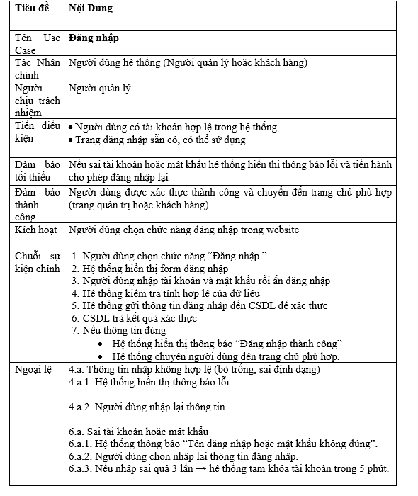

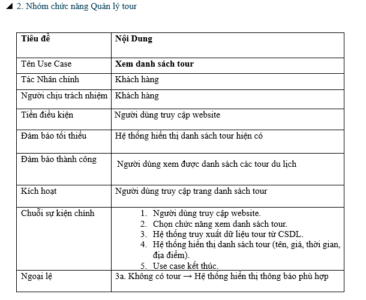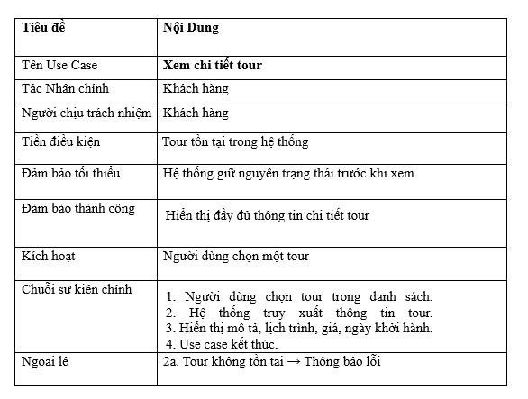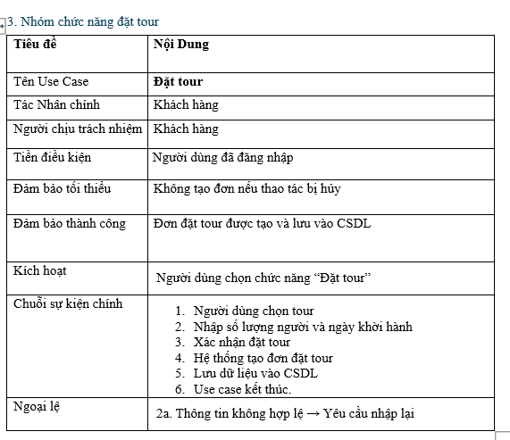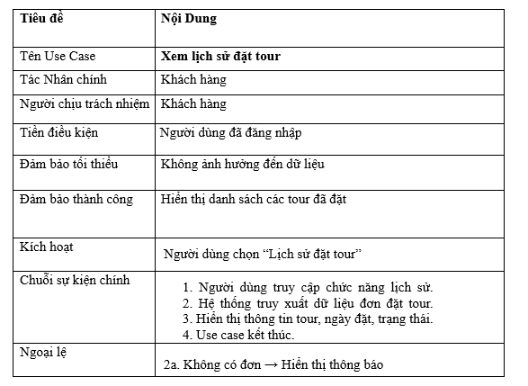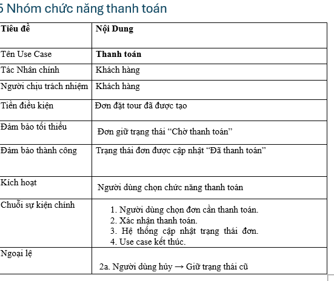

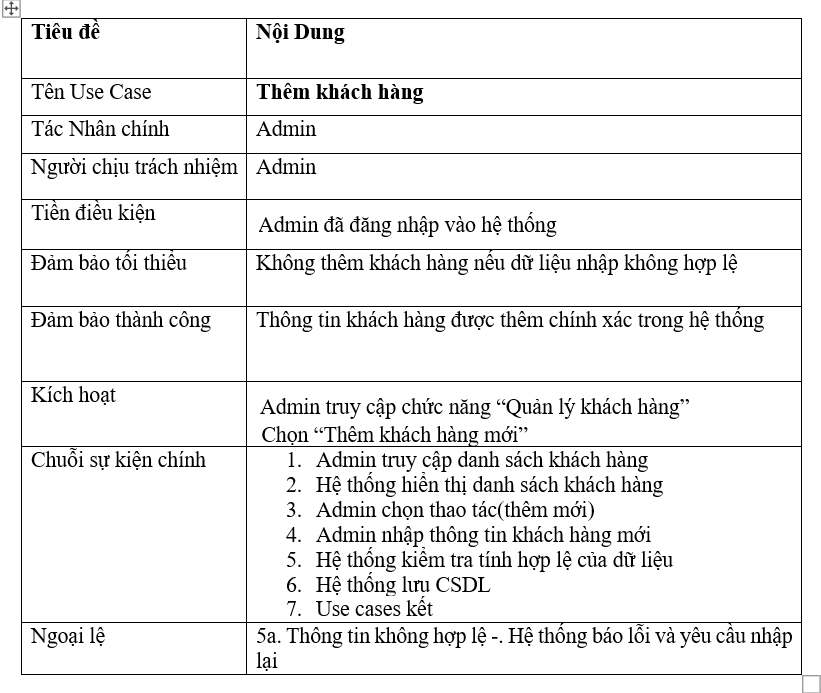

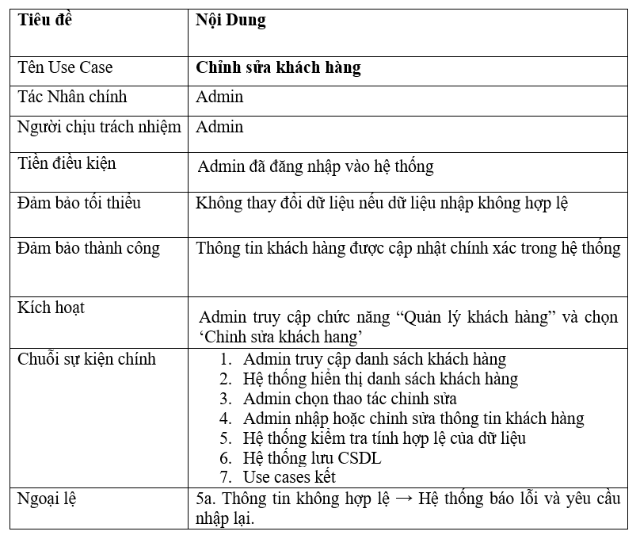

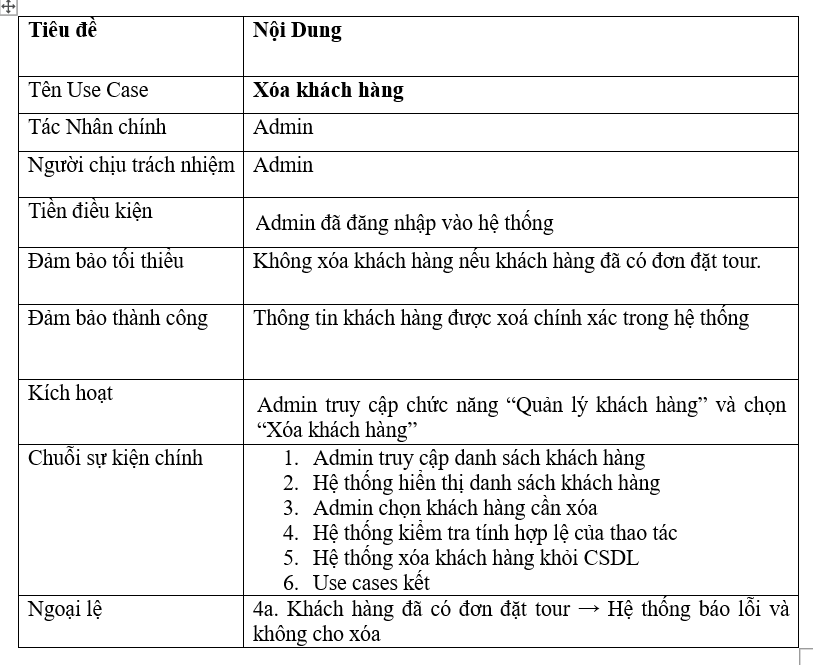
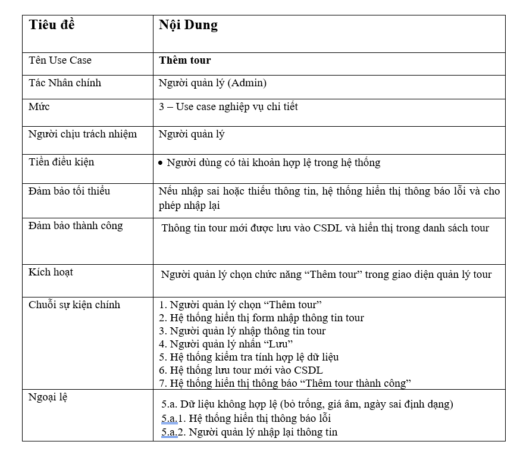

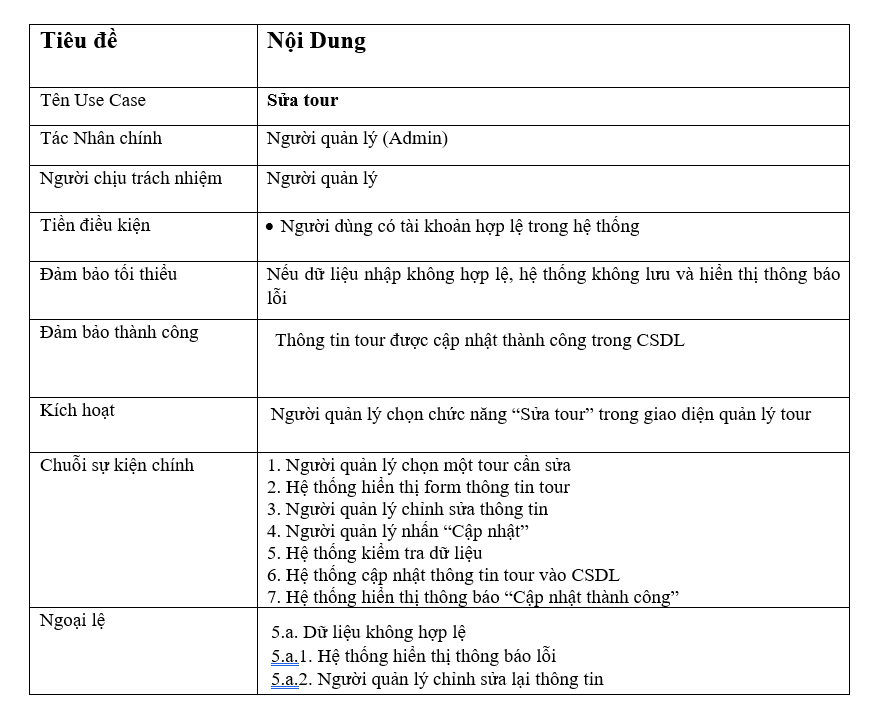

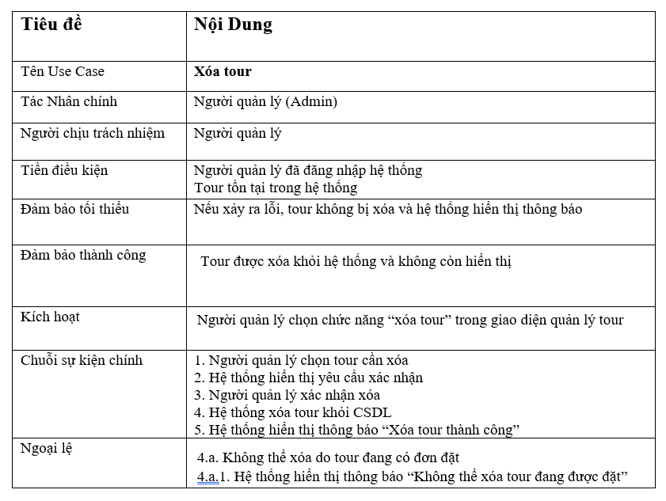

## Sơ đồ tuần tự

# Sơ đồ lớp

## Sơ đồ hoạt động

## Yêu cầu về công nghệ

* Front-end: HTML, CSS, JS, React.js.
* Back-end: Spring boot.
* Database: MySQL.

## Kết luận

Phần phân tích yêu cầu đã xác định rõ đối tượng sử dụng, các chức năng chính và phạm vi của Website Đặt Tour Du Lịch.
